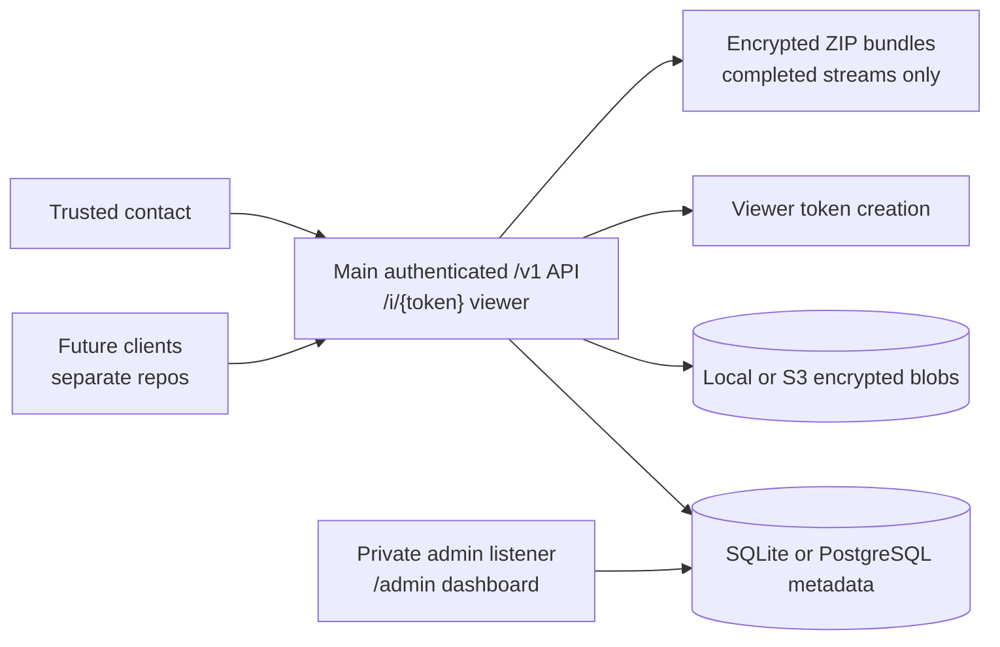

# Proofline Server

[](https://github.com/open-proofline/server/actions/workflows/ci.yml)
[](https://github.com/open-proofline/server/tags)
[](LICENSE)
[](go.mod)
[](#security-warning)
[](SECURITY.md)
[](https://github.com/orgs/open-proofline/packages/container/package/server)

Proofline Server is the experimental Go server backend for encrypted incident capture. It receives already-encrypted recording chunks through authenticated main `/v1` routes, stores metadata in SQLite by default or optional PostgreSQL, keeps encrypted blobs on local disk by default or in optional S3-compatible object storage, serves a private admin dashboard under `/admin`, uses optional Valkey/Redis-compatible coordination for startup checks, route-class counters, and short-lived complete-upload leases when explicitly configured, and exposes a token-scoped read-only viewer for incident review.

> Repository role: this repository is the server/backend component only. In the multi-repo layout it is `open-proofline/server`, not the full Proofline product suite.
>
> Artifact note: the Go module path is `github.com/open-proofline/server`, the published GHCR image is `ghcr.io/open-proofline/server`, and release binaries use `proofline-server-*` names. Compatibility identifiers such as the v1 encryption envelope scheme and default SQLite filename may still use earlier `safety-recorder` names until separate protocol or data-layout migrations are explicitly designed.

## Security Warning

> This project is not production-ready public infrastructure. The main `/v1` API now requires local account sessions and shares a listener with the read-only incident viewer, but public exposure still needs deployment-specific TLS, abuse controls, browser credential review, logging review, and operational hardening. Existing `/v1/admin/...` JSON routes remain authenticated admin-only routes on the main handler and must not be routed from a public edge. The private-admin listener is the `/admin` dashboard surface only and must stay behind localhost, LAN, WireGuard, a firewall, or a strict reverse proxy. Separate bind addresses are a deployment boundary, not a complete security model.

## What It Is

This repository currently contains the Go server backend only. It does not
contain the web client, iOS client, Android client, protocol repository,
account portal, production recording client, or mobile app code. The simulator
may capture or encode local test segments for backend reference flows only.

The intended long-term Proofline product is broader than emergency-only recording: it should support private encrypted incident capture for emergencies, non-emergency interaction records, timed safety checks, and evidence notes.

Future client repositories are expected to record audio/video and supporting metadata in short chunks, encrypt them locally, and upload them continuously so already-uploaded evidence is retained if a phone is lost, damaged, powered off, or taken.

Evidence bundles are ZIP files containing encrypted chunks and JSON manifests. They are not decrypted, playable, or merged media exports.

The simulator encrypts generated chunks by default with the documented v1
AES-256-GCM envelope, can stage local file or ffmpeg test segments in
desktop-recorder mode, and verifies downloaded bundles locally. Keys remain
client-side and are not uploaded to the backend. Future production key custody
is expected to use a hybrid trusted-contact model; see
[docs/key-custody.md](docs/key-custody.md).

Planned production-cluster work is additive. SQLite metadata and local filesystem blob storage remain supported. Optional PostgreSQL metadata, S3-compatible object storage, and Valkey/Redis-compatible coordination are available only when explicitly configured. Complete-upload idempotency is implemented through metadata-backed upload-operation state, and Valkey can hold short-lived complete-upload leases and retry hints when configured. Resumable or partial-upload protocols remain future work. See [docs/production-cluster-scope.md](docs/production-cluster-scope.md).

## Planned Open Proofline Repositories

The intended organisation is `open-proofline`, with responsibilities split across repositories:

| Future repository | Responsibility |
|---|---|
| `open-proofline/server` | Go backend, main API, private admin web surface, read-only incident viewer, storage, migrations, deployment docs, and server release workflow. |
| `open-proofline/web-client` | Account portal, authorised incident review, trusted-contact access, and eventual replacement for the current token-only viewer. |
| `open-proofline/ios-client` | iOS incident capture, encrypted staging, upload, local account flows, and platform-specific recording behavior. |
| `open-proofline/android-client` | Android incident capture, encrypted staging, upload, local account flows, and platform-specific recording behavior. |
| `open-proofline/protocol` | Shared API specs, encryption envelope specs, bundle manifests, compatibility matrix, and conformance tests. |

This repository should remain scoped to the server/backend role. Product-level or client-specific work should be documented here only as planning context until the relevant future repository exists.

## Planned Incident Modes

Proofline should separate capture from escalation. A user may want to preserve a private encrypted record without treating every recording as an emergency.

Planned incident categories include:

| Mode | Purpose | Default escalation |
|---|---|---|
| Emergency incident | Active safety risk where trusted contacts may need urgent access. | Trusted-contact alert immediately or after a short configured delay. |
| Interaction record | Non-emergency record of important interactions, such as with police, security, landlords, employers, service providers, or other authorities. | No automatic escalation by default. |
| Safety check | Timed check-in flow for walking home, meeting someone, travel, fieldwork, or other elevated-risk situations. | Trusted contacts alerted if the user misses the check-in. |
| Evidence note | Quick photo, audio, location, or note bundle for damage, harassment, threats, or disputes. | No automatic escalation by default. |

The current backend stores generic incidents by default and can optionally store
`incident_mode`, `capture_profile`, `escalation_policy`, and `sharing_state`
metadata on main incident creation. Those fields are labels only: they do not
grant access, send notifications, change retention, change key custody, expose
trusted-contact workflows, or change public viewer and bundle behavior. See
[docs/incident-modes.md](docs/incident-modes.md).

Authenticated account owners can also register trusted-contact public-key
metadata and create or revoke incident/stream-scoped sharing grants for their
own incidents. These records are authorization and wrapping metadata only: they
do not add trusted-contact accounts, wrapped media-key delivery, browser or
backend decryption, public viewer changes, notifications, or key escrow.

## What Works Today

- Main authenticated `/v1` API listener group, including admin-only JSON routes
  that are not public-ready
- Private-admin dashboard listener for `/admin` and `/admin/static/...`
- Read-only incident viewer routes mounted on the main listener
- Local username/password accounts for regular users and admins
- Opaque server-side sessions with expiry and revocation
- Private admin-only HTML surface under `/admin` for bootstrap, login, local
  account listing, and password workflows
- SQLite metadata and local disk encrypted blob storage by default
- Optional PostgreSQL metadata backend for new deployments
- Optional S3-compatible encrypted blob storage for committed chunks
- Immutable chunk uploads with SHA-256 verification
- `Idempotency-Key` support for equivalent complete chunk upload retries
- Optional Valkey/Redis-compatible short-lived complete-upload leases and
  `upload_in_progress` retry hints when coordination is explicitly configured
- Authenticated duplicate chunk reconciliation for comparing accepted metadata with
  an expected chunk fingerprint
- Optional incident-mode, capture-profile, escalation-policy, and sharing-state
  metadata on main incident create/read routes
- Owner-scoped contact public-key metadata and sharing-grant records for owned
  incidents or streams
- Documented client-side chunk encryption envelope
- Media streams with `open`, `complete`, and `failed` states
- Completed encrypted stream and incident ZIP evidence bundle downloads
- Scoped viewer tokens with a default 24-hour expiry
- App-level main API route limiting by safe route class, with local in-memory
  counters by default and optional Valkey/Redis-compatible counters when
  coordination is explicitly configured
- App-level public viewer rate limiting by safe route class, with local
  in-memory counters by default and optional Valkey/Redis-compatible counters
  when coordination is explicitly configured
- Validated backend-selection config defaults for SQLite metadata, optional PostgreSQL metadata, local encrypted blobs, optional S3-compatible encrypted blobs, no coordination by default, and optional Valkey/Redis-compatible coordination
- Simulator CLI for encrypted upload, check-in, stream completion, bundle
  download/decrypt-verification, and durable desktop-recorder staging flows
- Docker image build and GitHub Actions / GHCR publishing

## What It Is Not Yet

- No iOS app
- No Android app
- No web client or account portal
- No protocol repository or shared conformance test suite
- No production recording client implementation
- No mode-driven access, notification, retention, trusted-contact account,
  key-custody, or viewer behavior
- No production client-side encryption implementation
- No implemented resumable or partial upload protocol; current Valkey upload
  leases are short-lived complete-upload hints, not durable evidence truth
- No implemented live or partial stream chunk access before stream completion
- No wrapped-key delivery, backend/browser decryption, raw key handling, server
  escrow, break-glass key access, or playable media export
- No push notifications, SMS, or Messenger integration
- No OAuth, JWT, public account portal, or public admin dashboard
- No built-in TLS, mode-specific retention policy, backup lifecycle enforcement, or production deployment hardening
- No emergency-services integration; users or trusted contacts remain responsible for contacting emergency services

## Architecture

Proofline Server runs separate main and private-admin HTTP listener groups from the same Go binary. The main listener serves authenticated `/v1` routes and the token-gated, read-only incident viewer. Existing `/v1/admin/...` JSON routes stay authenticated and admin-only on that main handler, but they are not public-ready routes and must be blocked by any public reverse proxy. The private-admin listener serves only the `/admin` dashboard route tree.



For more diagrams and package-level details, see [docs/architecture.md](docs/architecture.md) and [docs/code-map.md](docs/code-map.md). The planned cluster expansion is documented separately in [docs/production-cluster-scope.md](docs/production-cluster-scope.md).

## Quick Start

Requirements:

- Go 1.26.3
- SQLite via the bundled Go SQLite driver dependency
- Local disk storage for encrypted uploaded blobs by default

Run the backend:

```bash
SAFE_AUTH_BOOTSTRAP_SECRET='replace-with-local-bootstrap-secret' \
go run ./cmd/api
```

By default this starts:

| Listener | Address |
|---|---|
| Main API and incident viewer | `127.0.0.1:8080` |
| Private admin dashboard | `127.0.0.1:8081` |

The private admin web surface is available on the private-admin listener at
`http://127.0.0.1:8081/admin`.

In another terminal, create the first admin account:

```bash
curl -sS -X POST http://127.0.0.1:8081/admin/bootstrap \
  -H 'Content-Type: application/x-www-form-urlencoded' \
  --data-urlencode 'bootstrap_secret=replace-with-local-bootstrap-secret' \
  --data-urlencode 'username=admin' \
  --data-urlencode 'password=replace-with-a-long-local-password'
```

Stop the server, remove `SAFE_AUTH_BOOTSTRAP_SECRET`, and start it again. The
bootstrap route is disabled once an admin account exists.

In another terminal, run the simulator:

```bash
PROOFLINE_SIM_USERNAME=admin \
PROOFLINE_SIM_PASSWORD='replace-with-a-long-local-password' \
go run ./cmd/simclient --chunks 5 --interval 1s --download-bundle
```

The simulator creates an incident, creates a viewer token without printing the
token-bearing viewer URL, encrypts and uploads test chunks into a media stream,
sends checkins, completes the stream, downloads the encrypted bundle, and
verifies local decryption. See [docs/simulator.md](docs/simulator.md) for
encrypted bundle output, offline bundle verification, the durable
desktop-recorder mode, local file input, ffmpeg segment capture, and
poor-network retry controls, and simulator-only contact-wrapped key metadata
artifacts.

## Docker

Build from the repository root:

```bash
docker build -t proofline-server .
```

Run with local-only port publishing and a named data volume:

```bash
docker run --rm \
  -e SAFE_AUTH_BOOTSTRAP_SECRET='replace-with-local-bootstrap-secret' \
  -p 127.0.0.1:8080:8080 \
  -p 127.0.0.1:8081:8081 \
  -v proofline-server-data:/data \
  proofline-server
```

Use the private `/admin` bootstrap screen, or `POST /admin/bootstrap` with form
fields, to create the first admin account. Then restart the container without
`SAFE_AUTH_BOOTSTRAP_SECRET`.

Container defaults bind to `0.0.0.0` inside the container. Restrict host exposure with port publishing, firewall rules, WireGuard, or a reverse proxy. See [docs/deployment.md](docs/deployment.md).

## Documentation

- [Docs index](docs/README.md)
- [Getting started](docs/getting-started.md)
- [Architecture](docs/architecture.md)
- [Configuration](docs/configuration.md)
- [Production cluster scope](docs/production-cluster-scope.md)
- [Cluster backup, restore, and failure runbook](docs/cluster-backup-restore-runbook.md)
- [PostgreSQL metadata migration path and SQLite-to-PostgreSQL runbook](docs/postgresql-metadata-migration.md)
- [Cluster-safe upload operation semantics](docs/cluster-safe-upload-semantics.md)
- [Resumable upload and upload lease protocol](docs/resumable-upload-lease-protocol.md)
- [Incident capture modes](docs/incident-modes.md)
- [Mode-aware retention policy](docs/mode-aware-retention-policy.md)
- [/v1 access control](docs/v1-access-control.md)
- [Main API public exposure listener split](docs/public-api-listener-split.md)
- [Legacy unowned incident reassignment](docs/legacy-unowned-incident-reassignment.md)
- [Encryption](docs/encryption.md)
- [iOS local recorder prototype](docs/ios-local-recorder-prototype.md)
- [Key custody and emergency access](docs/key-custody.md)
- [Contact key sharing, grants, and wrapped-key metadata](docs/contact-key-sharing-grants.md)
- [Contact-wrapped key metadata simulator prototype](docs/contact-wrapped-key-metadata-simulator.md)
- [Browser-side decryption design](docs/browser-decryption.md)
- [Live partial stream access boundary](docs/live-partial-stream-access-boundary.md)
- [Break-glass key access design](docs/break-glass-key-access.md)
- [API reference](docs/api.md)
- [Deployment notes](docs/deployment.md), including SQLite WAL operations
- [Retention, backup, and deletion](docs/retention-backup-deletion.md)
- [Incident deletion and retention enforcement](docs/incident-deletion-retention-enforcement.md)
- [Security model](docs/security-model.md)
- [Threat model](docs/threat-model.md)
- [Simulator](docs/simulator.md)
- [Development](docs/development.md)
- [Compose smoke tests](compose/README.md)
- [Code map](docs/code-map.md)
- [Technical review reports](docs/reports/README.md)

## AI-Assisted Development

This project has been developed with substantial assistance from OpenAI Codex.

Codex has been used to draft, refactor, test, document, and review parts of the Go backend and Markdown documentation. All accepted changes are reviewed, tested, and committed by the maintainer.

AI assistance does not replace human responsibility. The maintainer remains responsible for:

- code correctness
- security review
- licensing decisions
- release decisions
- deployment choices
- any real-world use of the software

Use of Codex does not imply endorsement, audit, certification, or maintenance by OpenAI.

## Backlog workflow

Use `80-backlog-scan-issue-drafts.md` to generate reviewed local issue drafts under a branch-scoped directory such as `.backlog-drafts/YYYY-MM-DD/<branch-slug>/`.

Review those drafts manually before creating GitHub issues. Drafts are generated review artifacts, not the long-term source of truth once GitHub issues exist.

Only after review, use `85-create-github-issues-from-drafts.md` to generate `scripts/create-backlog-issues.sh` and `.backlog-drafts/.../create-issues-review.md`. Do not run the generated script unless the maintainer explicitly asks for issue creation.

Do not let Codex create GitHub issues directly during the initial scan.

## Security

Viewer links and `/v1` session tokens are bearer credentials and should be treated as secrets. Public deployment still needs TLS, rate limiting, log review, proxy hardening, operational testing, and deployment-specific retention, backup, and deletion enforcement. Do not expose `/v1` publicly as-is.

Please see [SECURITY.md](SECURITY.md) for supported versions and vulnerability reporting guidance. Do not report security vulnerabilities through public GitHub issues.

## Roadmap

- Create future `open-proofline/web-client`, `open-proofline/ios-client`, `open-proofline/android-client`, and `open-proofline/protocol` repositories when their scopes are ready
- Plan any future protocol or data-layout compatibility migrations separately from the completed repository/module/artifact rename
- Continue hardening optional PostgreSQL metadata support while preserving SQLite local/default support
- Complete the remaining cluster-safe upload operation semantics before multi-node production deployment
- Keep cluster backup, restore, and failure runbooks current as optional PostgreSQL, S3-compatible storage, and coordination behavior evolve
- WireGuard-only bind/firewall deployment guidance
- Mode-driven access, escalation, retention, sharing, viewer, and key-custody
  behavior after protocol and security design
- Server-side support for trusted-contact dead-man switch workflows after access-control design
- Production key custody, trusted-contact account access, wrapped-key delivery,
  and browser/client-side decryption
- Optional break-glass/dead-man-switch key access
- Playable media export
- Reverse-proxy/TLS hardening for incident viewer exposure
- Explicit [`/v1` access-control story](docs/v1-access-control.md) before any public product API deployment

## License

Proofline Server is licensed under the GNU Affero General Public License v3.0 only (`AGPL-3.0-only`). See [LICENSE](LICENSE).
