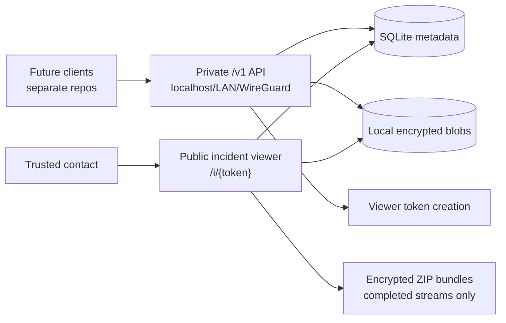

# Proofline Server

[](https://github.com/TheSilkky/safety-recorder/actions/workflows/ci.yml)
[](https://github.com/TheSilkky/safety-recorder/tags)
[](LICENSE)
[](server/go.mod)
[](#security-warning)
[](SECURITY.md)
[](https://github.com/TheSilkky/safety-recorder/pkgs/container/safety-recorder)

Proofline Server is the experimental Go server backend for private encrypted incident capture. It receives already-encrypted recording chunks, stores metadata in SQLite, keeps encrypted blobs on local disk, and exposes a token-scoped read-only viewer for incident review.

> Repository role: this repository is the server/backend component only. In the planned multi-repo layout it corresponds to `open-proofline/server`, not the full Proofline product suite.
>
> Migration note: the current GitHub repository, Go module paths, Docker image names, and GHCR package names may still use `safety-recorder` until a separate repository/organisation migration is explicitly performed.

## Security Warning

> This project is not production-ready public infrastructure. The private `/v1` API has no public user authentication and must stay behind localhost, LAN, WireGuard, a firewall, or a strict reverse proxy. Separate bind addresses are a deployment boundary, not a complete security model.

## What It Is

This repository currently contains the Go server backend only. It does not contain the web client, iOS client, Android client, protocol repository, account portal, recording implementation, or mobile app code.

The intended long-term Proofline product is broader than emergency-only recording: it should support private encrypted incident capture for emergencies, non-emergency interaction records, timed safety checks, and evidence notes.

Future client repositories are expected to record audio/video and supporting metadata in short chunks, encrypt them locally, and upload them continuously so already-uploaded evidence is retained if a phone is lost, damaged, powered off, or taken.

Evidence bundles are ZIP files containing encrypted chunks and JSON manifests. They are not decrypted, playable, or merged media exports.

The simulator encrypts fake chunks by default with the documented v1 AES-256-GCM envelope and verifies downloaded bundles locally. Keys remain client-side and are not uploaded to the backend. Future production key custody is expected to use a hybrid trusted-contact model; see [docs/key-custody.md](docs/key-custody.md).

## Planned Open Proofline Repositories

The intended organisation is `open-proofline`, with responsibilities split across repositories:

| Future repository | Responsibility |
|---|---|
| `open-proofline/server` | Go backend, private API, public incident viewer, storage, migrations, deployment docs, and server release workflow. |
| `open-proofline/web-client` | Account portal, authorised incident review, trusted-contact access, and eventual replacement for the current token-only viewer. |
| `open-proofline/ios-client` | iOS incident capture, encrypted staging, upload, local account flows, and platform-specific recording behavior. |
| `open-proofline/android-client` | Android incident capture, encrypted staging, upload, local account flows, and platform-specific recording behavior. |
| `open-proofline/protocol` | Shared API specs, encryption envelope specs, bundle manifests, compatibility matrix, and conformance tests. |

This repository should remain scoped to the server/backend role. Product-level or client-specific work should be documented here only as planning context until the relevant future repository exists.

## Planned Incident Modes

Proofline should separate capture from escalation. A user may want to preserve a private encrypted record without treating every recording as an emergency.

Planned incident categories include:

| Mode | Purpose | Default escalation |
|---|---|---|
| Emergency incident | Active safety risk where trusted contacts may need urgent access. | Trusted-contact alert immediately or after a short configured delay. |
| Interaction record | Non-emergency record of important interactions, such as with police, security, landlords, employers, service providers, or other authorities. | No automatic escalation by default. |
| Safety check | Timed check-in flow for walking home, meeting someone, travel, fieldwork, or other elevated-risk situations. | Trusted contacts alerted if the user misses the check-in. |
| Evidence note | Quick photo, audio, location, or note bundle for damage, harassment, threats, or disputes. | No automatic escalation by default. |

The current backend still stores generic incidents. First-class incident types, escalation policies, account access, and trusted-contact workflows are future protocol/client/server work. See [docs/incident-modes.md](docs/incident-modes.md).

## What Works Today

- Private `/v1` write/admin API listener group
- Public read-only incident viewer listener group
- SQLite metadata and local disk encrypted blob storage
- Immutable chunk uploads with SHA-256 verification
- Documented client-side chunk encryption envelope
- Media streams with `open`, `complete`, and `failed` states
- Completed encrypted stream and incident ZIP evidence bundle downloads
- Scoped viewer tokens with a default 24-hour expiry
- Simulator CLI for encrypted upload, check-in, stream completion, and bundle download/decrypt-verification flows
- Docker image build and GitHub Actions / GHCR publishing

## What It Is Not Yet

- No iOS app
- No Android app
- No web client or account portal
- No protocol repository or shared conformance test suite
- No recording implementation
- No first-class incident-type or escalation-policy schema
- No production client-side encryption implementation
- No backend/browser decryption, key sharing, server escrow, break-glass key access, or playable media export
- No push notifications, SMS, or Messenger integration
- No user accounts, OAuth, JWT, or public admin dashboard
- No built-in TLS, app-level rate limiting, automated retention/deletion enforcement, or production deployment hardening
- No emergency-services integration; users or trusted contacts remain responsible for contacting emergency services

## Architecture

Proofline Server runs separate private and public HTTP listener groups from the same Go binary. Private `/v1` routes handle writes and admin-style operations. Public viewer routes are token-gated and read-only.



For more diagrams and package-level details, see [docs/architecture.md](docs/architecture.md) and [docs/code-map.md](docs/code-map.md).

## Quick Start

Requirements:

- Go 1.26.3
- SQLite via the bundled Go SQLite driver dependency
- Local disk storage for encrypted uploaded blobs

Run the backend:

```bash
cd server
go run ./cmd/api
```

By default this starts:

| Listener | Address |
|---|---|
| Private API | `127.0.0.1:8080` |
| Public incident viewer | `127.0.0.1:8081` |

In another terminal, run the simulator:

```bash
cd server
go run ./cmd/simclient --chunks 5 --interval 1s --download-bundle
```

The simulator creates an incident, creates a viewer token, encrypts and uploads test chunks into a media stream, sends checkins, completes the stream, downloads the encrypted bundle, and verifies local decryption.

## Docker

Build from the repository root:

```bash
docker build -t safety-recorder-backend ./server
```

Run with local-only port publishing and a named data volume:

```bash
docker run --rm \
  -p 127.0.0.1:8080:8080 \
  -p 127.0.0.1:8081:8081 \
  -v safety-recorder-data:/data \
  safety-recorder-backend
```

Container defaults bind to `0.0.0.0` inside the container. Restrict host exposure with port publishing, firewall rules, WireGuard, or a reverse proxy. See [docs/deployment.md](docs/deployment.md).

## Documentation

- [Docs index](docs/README.md)
- [Getting started](docs/getting-started.md)
- [Architecture](docs/architecture.md)
- [Configuration](docs/configuration.md)
- [Incident capture modes](docs/incident-modes.md)
- [Encryption](docs/encryption.md)
- [iOS local recorder prototype](docs/ios-local-recorder-prototype.md)
- [Key custody and emergency access](docs/key-custody.md)
- [Browser-side decryption design](docs/browser-decryption.md)
- [Break-glass key access design](docs/break-glass-key-access.md)
- [API reference](docs/api.md)
- [Deployment notes](docs/deployment.md)
- [Retention, backup, and deletion](docs/retention-backup-deletion.md)
- [Security model](docs/security-model.md)
- [Threat model](docs/threat-model.md)
- [Simulator](docs/simulator.md)
- [Development](docs/development.md)
- [Code map](docs/code-map.md)
- [Technical review reports](docs/reports/README.md)

## AI-Assisted Development

This project has been developed with substantial assistance from OpenAI Codex.

Codex has been used to draft, refactor, test, document, and review parts of the Go backend and Markdown documentation. All accepted changes are reviewed, tested, and committed by the maintainer.

AI assistance does not replace human responsibility. The maintainer remains responsible for:

- code correctness
- security review
- licensing decisions
- release decisions
- deployment choices
- any real-world use of the software

Use of Codex does not imply endorsement, audit, certification, or maintenance by OpenAI.

## Backlog workflow

Use `80-backlog-scan-issue-drafts.md` to generate reviewed local issue drafts under a branch-scoped directory such as `.backlog-drafts/YYYY-MM-DD/<branch-slug>/`.

Review those drafts manually before creating GitHub issues. Drafts are generated review artifacts, not the long-term source of truth once GitHub issues exist.

Only after review, use `85-create-github-issues-from-drafts.md` to generate `scripts/create-backlog-issues.sh` and `.backlog-drafts/.../create-issues-review.md`. Do not run the generated script unless the maintainer explicitly asks for issue creation.

Do not let Codex create GitHub issues directly during the initial scan.

## Security

Viewer links are bearer-token URLs and should be treated as secrets. Public deployment still needs TLS, rate limiting, log review, proxy hardening, operational testing, and deployment-specific retention, backup, and deletion enforcement. Do not expose `/v1` publicly as-is.

Please see [SECURITY.md](SECURITY.md) for supported versions and vulnerability reporting guidance. Do not report security vulnerabilities through public GitHub issues.

## Roadmap

- Migrate this repository to `open-proofline/server`, if/when the organisation split is performed
- Create future `open-proofline/web-client`, `open-proofline/ios-client`, `open-proofline/android-client`, and `open-proofline/protocol` repositories when their scopes are ready
- Rename/migrate module, Docker, and GHCR names after repository migration is planned
- WireGuard-only bind/firewall deployment guidance
- Server-side support for first-class incident types and escalation policies after protocol design
- Server-side support for trusted-contact dead-man switch workflows after access-control design
- Production key custody, trusted-contact access, and browser/client-side decryption
- Optional break-glass/dead-man-switch key access
- Playable media export
- Reverse-proxy/TLS hardening for incident viewer exposure
- Explicit `/v1` access-control story before any public control-plane deployment

## License

Proofline Server is licensed under the GNU Affero General Public License v3.0 only (`AGPL-3.0-only`). See [LICENSE](LICENSE).
