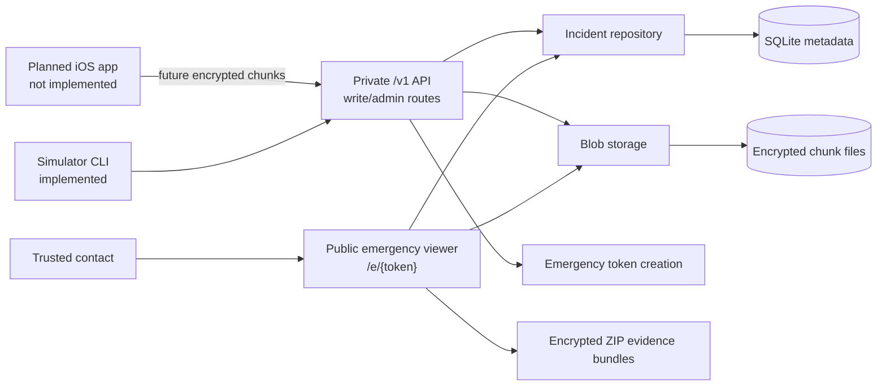
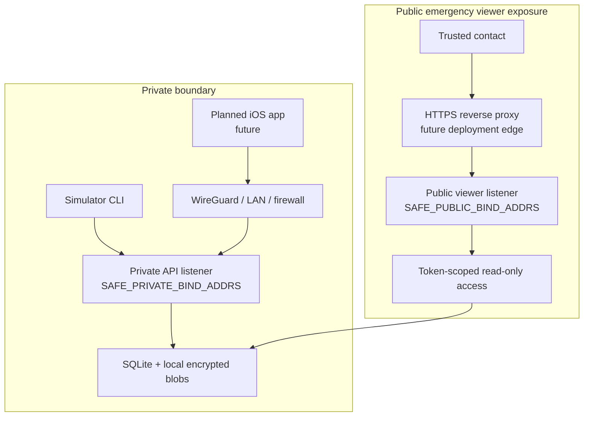
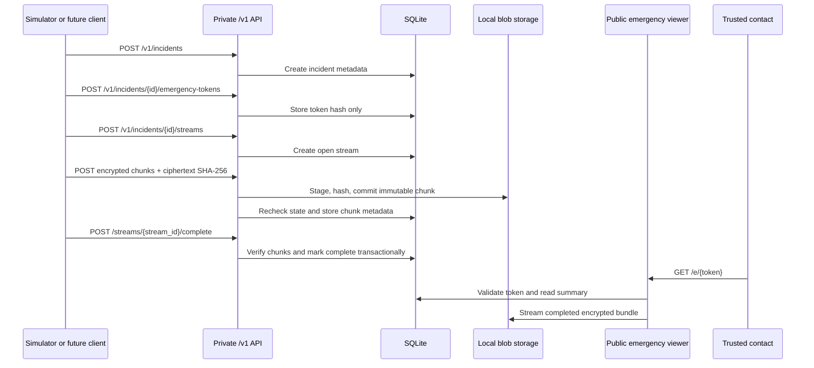
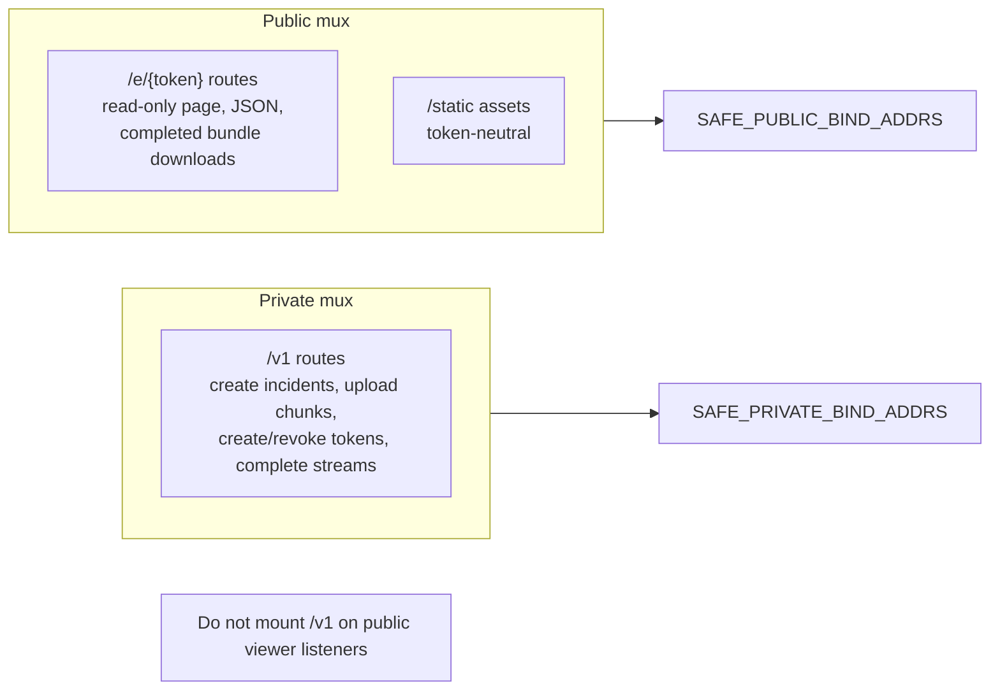

# Architecture

Safety Recorder is a single Go backend binary with separate private and public HTTP listener groups. It stores incident metadata in SQLite and encrypted uploaded chunks on local disk.

The repository does not contain an iOS app, recording implementation, production client key storage, key sharing, browser/client-side decryption, server-assisted break-glass key access, or playable media export. The Go simulator can produce the documented v1 client-side encryption envelope for development and test flows. Future key custody and emergency access design is documented in [key-custody.md](key-custody.md), [browser-decryption.md](browser-decryption.md), and [break-glass-key-access.md](break-glass-key-access.md).

## High-Level System

## Example Network Topology

## Incident Data Flow

## Private/Public Server Boundary

## Evidence Bundles

Completed stream and incident downloads are ZIP files generated on demand. ZIP entry names are controlled by the server and manifests are generated from trusted database metadata. Bundles contain encrypted chunks and JSON manifests only.

They are not decrypted, playable, or merged media exports.
