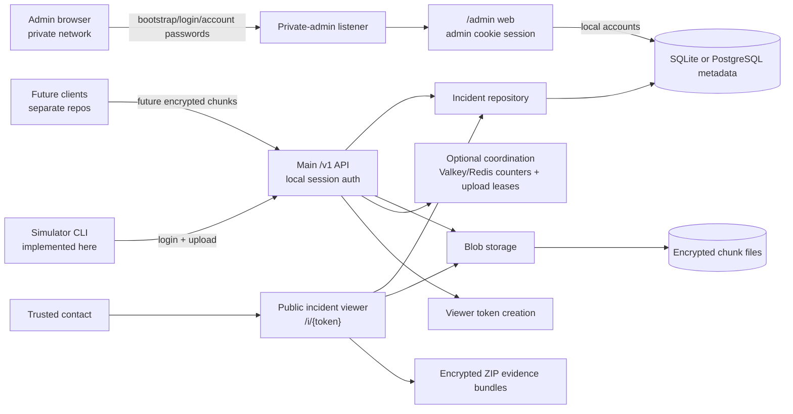
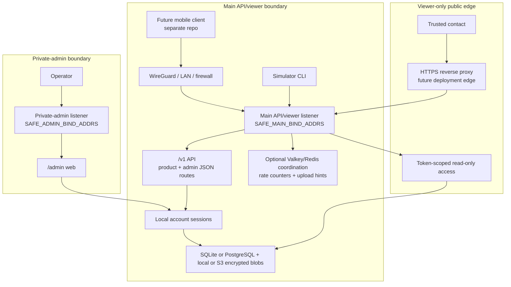
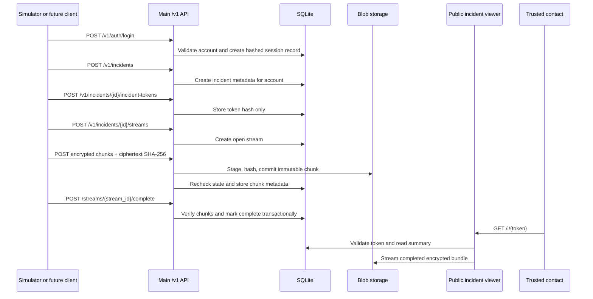
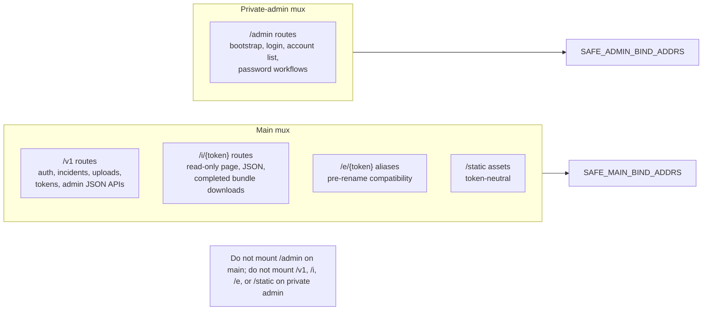

# Architecture

Proofline Server is currently a single Go backend binary with separate main
API/viewer and private-admin HTTP listener groups. It stores incident metadata
in SQLite by default or optional PostgreSQL, encrypted uploaded chunks on local
disk by default with optional S3-compatible object storage for committed
encrypted chunks, a private `/admin` dashboard listener, and optional
Valkey/Redis-compatible short-lived coordination when explicitly configured.
The future regional stream-ingress relay is planning-only and documented in
[regional-stream-ingress-relay.md](regional-stream-ingress-relay.md).

This repository is the server/backend component only. In the planned multi-repo layout it corresponds to `open-proofline/server`. Web, iOS, Android, and shared protocol work are expected to live in separate future repositories.

The long-term product direction is broader than emergency-only recording. Future
clients may support emergency incidents, non-emergency interaction records,
timed safety checks, and evidence notes. The current backend stores generic
incidents by default, can store optional incident-mode, capture-profile,
escalation-policy, and sharing-state metadata on main incident create/read
routes, and has local username/password accounts with opaque server-side
sessions for the main `/v1` API, existing admin-only JSON routes under
`/v1/admin/...`, plus a private admin web surface under `/admin`.
Mode-driven access, escalation, retention, sharing, key custody,
trusted-contact accounts, notification delivery, and mobile/web clients are not
implemented yet. Planned mode behavior, escalation, migration, and
viewer-wording boundaries are documented in [incident-modes.md](incident-modes.md),
and current local session behavior plus future public product API, separately
bound private admin API, role, and grant boundaries are documented in
[v1-access-control.md](v1-access-control.md).

The repository does not contain an iOS app, Android app, web client, protocol
package, production recording client, production client key storage, key
sharing, browser/client-side decryption, server-assisted break-glass key access,
notification system, trusted-contact account model, future public product API,
future separately bound private admin API, OAuth/JWT identity integration, or
playable media export. The Go simulator can produce the documented v1
client-side encryption envelope and local desktop-recorder test segments for
development and test flows only. Future key custody and emergency access design
is documented in [key-custody.md](key-custody.md),
[browser-decryption.md](browser-decryption.md), and
[break-glass-key-access.md](break-glass-key-access.md).

## High-Level System



## Planned Open Proofline Repository Layout

The intended organisation is `open-proofline`.

Planned repositories:

```text
open-proofline/server
open-proofline/web-client
open-proofline/ios-client
open-proofline/android-client
open-proofline/protocol
```

Responsibilities:

| Repository | Responsibility |
|---|---|
| `server` | Go backend, authenticated main API, private admin web surface, public incident viewer, SQLite migrations, encrypted blob storage, deployment docs, and server release workflow. |
| `web-client` | Account portal, authorised incident review, trusted-contact access, and eventual replacement for the current token-only viewer. |
| `ios-client` | iOS incident capture, encrypted staging, upload, local account flows, and platform-specific recording behavior. |
| `android-client` | Android incident capture, encrypted staging, upload, local account flows, and platform-specific recording behavior. |
| `protocol` | Shared API specs, encryption envelope specs, bundle manifests, compatibility matrix, and conformance tests. |

The Go module path is `github.com/open-proofline/server`, release binaries use `proofline-server-*` names, and the published GHCR image is `ghcr.io/open-proofline/server`. Compatibility identifiers such as the v1 simulator encryption envelope and default SQLite filename may still use earlier `safety-recorder` names until separate protocol or data-layout migrations are explicitly performed.

## Server Boundary

This repository should remain scoped to backend server responsibilities:

- HTTP API implementation
- SQLite migrations and metadata repository code
- encrypted blob storage
- current token-scoped incident viewer
- deployment and operations docs
- simulator/reference backend flow
- backend security, retention, and threat-model docs

Do not add future web-client, iOS-client, Android-client, or protocol implementation here unless the maintainer explicitly changes the repository strategy.

## Example Network Topology



## Incident Data Flow



Future clients may classify incidents as emergency incidents, interaction
records, safety checks, or evidence notes through the current optional private
API metadata fields. Those fields are not behavior flags and do not change
access, notification, retention, sharing, key custody, viewer, or bundle
behavior.

## Main/Admin Server Boundary



## Evidence Bundles

Completed stream and incident downloads are ZIP files generated on demand. ZIP entry names are controlled by the server and manifests are generated from trusted database metadata. Bundles contain encrypted chunks and JSON manifests only.

They are not decrypted, playable, or merged media exports.

## Regional Ingress Relay Boundary

The planned regional stream-ingress relay is a separate optional upload edge,
not a durable evidence store and not a broad API gateway. It should expose only
a narrow complete-chunk upload route family plus coarse health/readiness
routes, stage ciphertext temporarily, and forward complete encrypted chunks to
the core API. The core API remains responsible for account/session or future
upload authorization, incident and stream state, idempotency decisions,
duplicate reconciliation, final blob commits, and metadata.

The relay must not expose `/admin`, `/v1/admin/...`, public incident viewer
routes, bundle downloads, deletion, retention, backup, restore, escrow,
break-glass, decryption, raw-key, or operator routes. Loss of relay temporary
staging must be recoverable by client retry.

## Emergency Services Boundary

Proofline Server does not currently contact emergency services. Future dead-man switch or safety-check designs should rely on trusted contacts to review the context and decide whether to call emergency services unless a future jurisdiction-specific emergency-services integration is explicitly designed, implemented, and documented.
