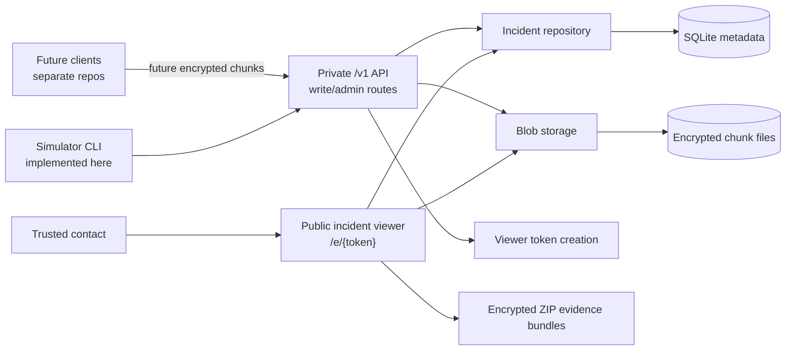
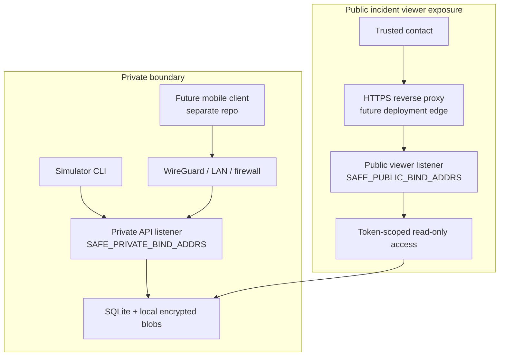
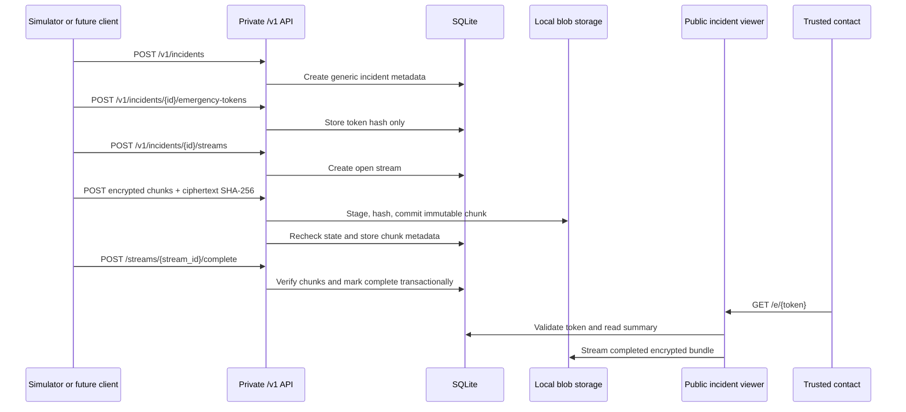
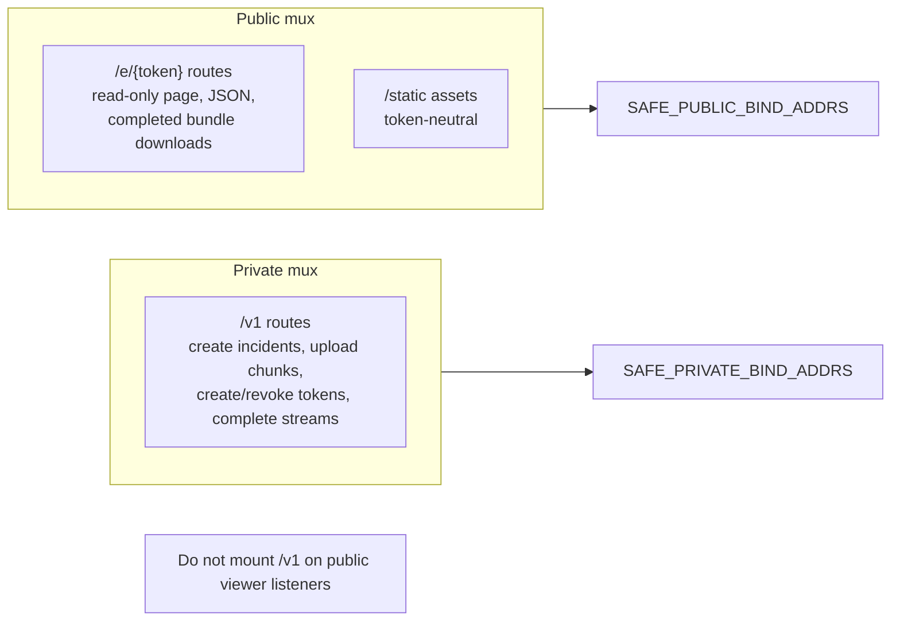

# Architecture

Proofline Server is currently a single Go backend binary with separate private and public HTTP listener groups. It stores incident metadata in SQLite and encrypted uploaded chunks on local disk.

This repository is the server/backend component only. In the planned multi-repo layout it corresponds to `open-proofline/server`. Web, iOS, Android, and shared protocol work are expected to live in separate future repositories.

The long-term product direction is broader than emergency-only recording. Future clients may support emergency incidents, non-emergency interaction records, timed safety checks, and evidence notes. The current backend still stores generic incidents; first-class incident types, escalation policies, account access, trusted-contact accounts, notification delivery, and mobile/web clients are not implemented yet. Planned modes are documented in [incident-modes.md](incident-modes.md).

The repository does not contain an iOS app, Android app, web client, protocol package, recording implementation, production client key storage, key sharing, browser/client-side decryption, server-assisted break-glass key access, notification system, user account model, or playable media export. The Go simulator can produce the documented v1 client-side encryption envelope for development and test flows. Future key custody and emergency access design is documented in [key-custody.md](key-custody.md), [browser-decryption.md](browser-decryption.md), and [break-glass-key-access.md](break-glass-key-access.md).

## High-Level System



## Planned Open Proofline Repository Layout

The intended organisation is `open-proofline`.

Planned repositories:

```text
open-proofline/server
open-proofline/web-client
open-proofline/ios-client
open-proofline/android-client
open-proofline/protocol
```

Responsibilities:

| Repository | Responsibility |
|---|---|
| `server` | Go backend, private API, public incident viewer, SQLite migrations, encrypted blob storage, deployment docs, and server release workflow. |
| `web-client` | Account portal, authorised incident review, trusted-contact access, and eventual replacement for the current token-only viewer. |
| `ios-client` | iOS incident capture, encrypted staging, upload, local account flows, and platform-specific recording behavior. |
| `android-client` | Android incident capture, encrypted staging, upload, local account flows, and platform-specific recording behavior. |
| `protocol` | Shared API specs, encryption envelope specs, bundle manifests, compatibility matrix, and conformance tests. |

This repository has not been moved yet. Repository URLs, module paths, Docker image names, and GHCR package names may still use `safety-recorder` until a separate migration is performed.

## Server Boundary

This repository should remain scoped to backend server responsibilities:

- HTTP API implementation
- SQLite migrations and metadata repository code
- encrypted blob storage
- current token-scoped incident viewer
- deployment and operations docs
- simulator/reference backend flow
- backend security, retention, and threat-model docs

Do not add future web-client, iOS-client, Android-client, or protocol implementation here unless the maintainer explicitly changes the repository strategy.

## Example Network Topology



## Incident Data Flow



Future clients may classify the same generic backend incident as an emergency incident, interaction record, safety check, or evidence note in client/protocol metadata after that design exists. The current API does not yet store a first-class incident type.

## Private/Public Server Boundary



## Evidence Bundles

Completed stream and incident downloads are ZIP files generated on demand. ZIP entry names are controlled by the server and manifests are generated from trusted database metadata. Bundles contain encrypted chunks and JSON manifests only.

They are not decrypted, playable, or merged media exports.

## Emergency Services Boundary

Proofline Server does not currently contact emergency services. Future dead-man switch or safety-check designs should rely on trusted contacts to review the context and decide whether to call emergency services unless a future jurisdiction-specific emergency-services integration is explicitly designed, implemented, and documented.
